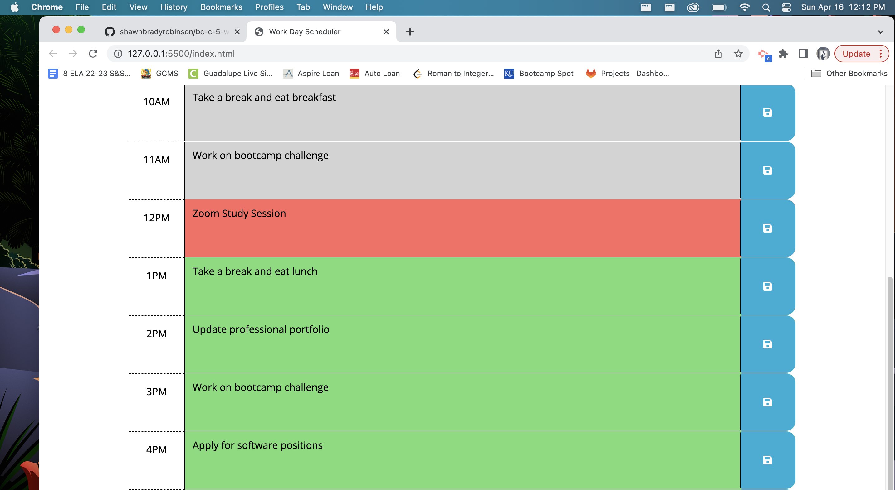

# Bootcamp Challenge 5 - Work Day Scheduler 

# Shawn Robinson 

## **Description**
The "Work Day Scheduler" application is an awesome way for productive individuals to keep track of their tasks and responsibilities for the day! 

The application has a colorful and vibrant interface, that visually communicates to the user where they should orient their focus. 

The "Work Day Scheduler" app keeps track of current time in the day up to the very second, and will color code the hours of the day based on this information. Find the red box to get started adding in things for the rest of the day, or navigate to the 7AM box at the top to get a head start on scheduling for tomorrow!

Once you have entered information in a time slot, simply press the corresonding "save" icon, and your to-do's will stay put, even upon refresh! One less thing you need to worry about as you work your way through the day! 

An element that makes this application stand out beyond other applications is the fact that the user is given visual feedback whenever they hit a save button on the tracker, allowing the user to have the peace of mind the application has properly processed their request! 

# Application Link 

Try my "Work Day Scheduler" application for yourself at: https://shawnbradyrobinson.github.io/bc-c-5-workdayscheduler/

## Credits
- Information on how to utilize the day.js api from: https://day.js.org/docs/en/get-set/get-set
- Information on how to utilize jQuery from: https://api.jquery.com/data/

## License

MIT License

Copyright (c) 2023 shawnbradyrobinson

Permission is hereby granted, free of charge, to any person obtaining a copy
of this software and associated documentation files (the "Software"), to deal
in the Software without restriction, including without limitation the rights
to use, copy, modify, merge, publish, distribute, sublicense, and/or sell
copies of the Software, and to permit persons to whom the Software is
furnished to do so, subject to the following conditions:

The above copyright notice and this permission notice shall be included in all
copies or substantial portions of the Software.

THE SOFTWARE IS PROVIDED "AS IS", WITHOUT WARRANTY OF ANY KIND, EXPRESS OR
IMPLIED, INCLUDING BUT NOT LIMITED TO THE WARRANTIES OF MERCHANTABILITY,
FITNESS FOR A PARTICULAR PURPOSE AND NONINFRINGEMENT. IN NO EVENT SHALL THE
AUTHORS OR COPYRIGHT HOLDERS BE LIABLE FOR ANY CLAIM, DAMAGES OR OTHER
LIABILITY, WHETHER IN AN ACTION OF CONTRACT, TORT OR OTHERWISE, ARISING FROM,
OUT OF OR IN CONNECTION WITH THE SOFTWARE OR THE USE OR OTHER DEALINGS IN THE
SOFTWARE.

---
